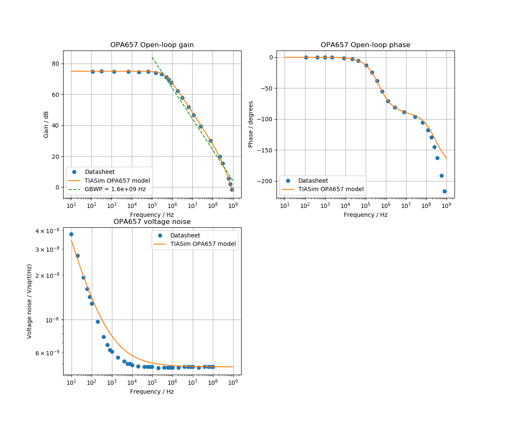

# TIASim
TIASim - Transimpedance Amplifier Simulation.

For some example designs and comparisons to TIASim see [One Inch Phototdetector](https://github.com/aewallin/One-Inch-Photodetector).

Analog Devices has a Photodiode Circuit Design Wizard at https://tools.analog.com/en/photodiode/

## References

* Hobbs, [Photodiode front ends](https://electrooptical.net/static/oldsite/www/frontends/frontends.pdf)
* Transimpedance Amplifiers (TIA): Choosing the Best Amplifier for the Job, http://www.ti.com.cn/cn/lit/an/snoa942a/snoa942a.pdf
* Transimpedance Considerations for High-Speed Amplifiers http://www.ti.com/lit/an/sboa122/sboa122.pdf
  - RF lower than 2 kOhm -> use BJT opamp
  - RF higher than 2 kOhm -> use FET opamp

## op-amps

Open-loop gain, input-referred voltage and current noise, and input-capacitance are modeled for the following op-amps:

| Op-amp        | Input           | Bandwidth | Inp Capacitance | Supply Voltage  |
| ------------- | -------------   | --------- | --------------- | --------------- |
| OPA657        | FET             |  1.6 GHz  | 5.2 pF          | 13 V            |
| OPA859        | FET             |  1.8 GHz  | 0.8 pF          | 5 V             |
| OPA847        | BJT             |  3.9 GHz  | 3.7 pF          | 13 V            |
| OPA858        | FET             |  5.5 GHz  | 0.8 pF          | 5 V             |
| OPA855        | BJT             |  8 GHz    | 0.8 pF          | 5 V             |

The following might be good additions or comparisons: OPA818 (2.7GHz, 2.4pF, 13V), HMC799 (10kOhm TIA), LTC6268-10

### OPA657
http://www.ti.com/lit/ds/symlink/opa657.pdf

### OPA847
http://www.ti.com/lit/ds/symlink/opa847.pdf

### OPA855
http://www.ti.com/lit/ds/symlink/opa855.pdf

