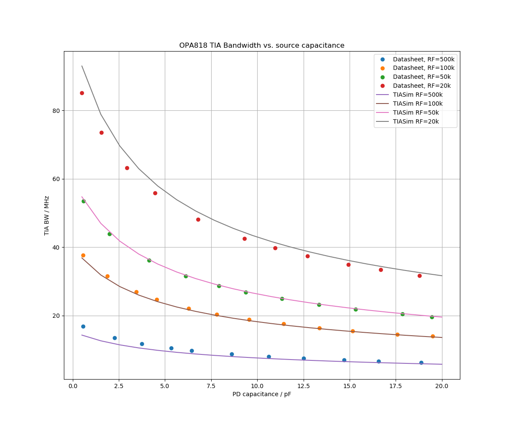
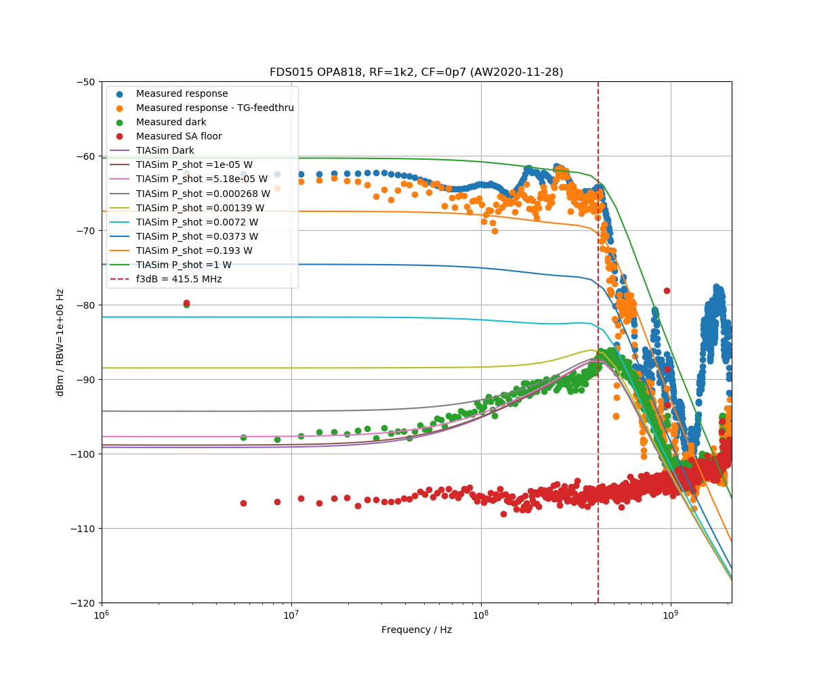
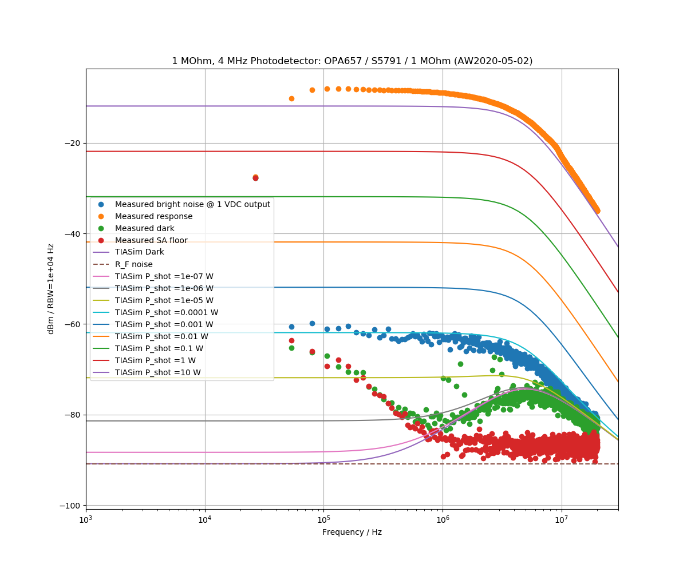
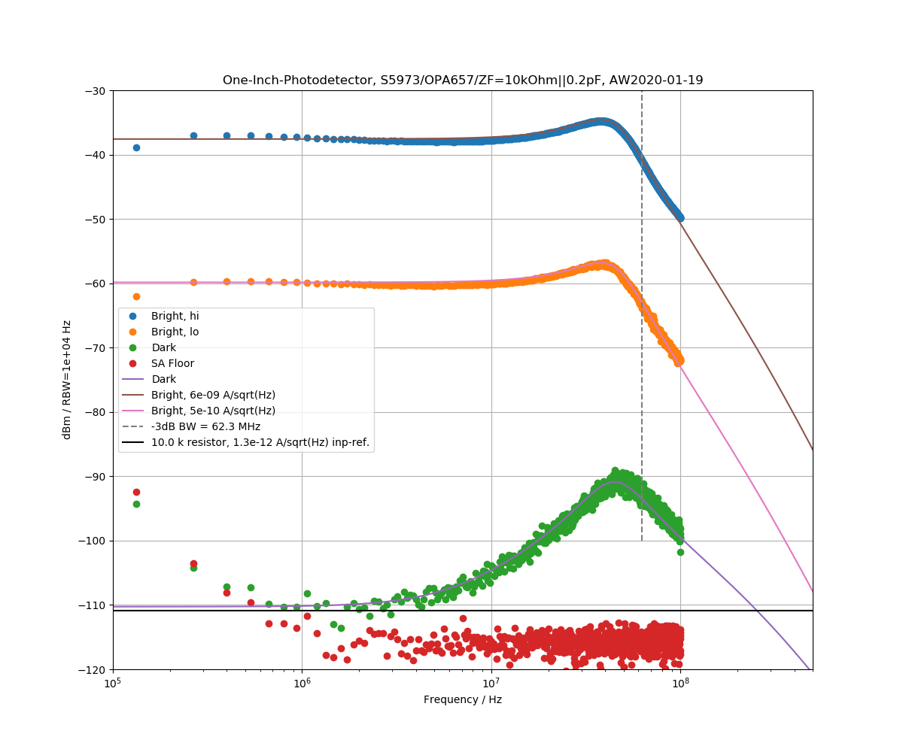

# TIASim
TIASim - Transimpedance Amplifier Simulation.

For some example designs and comparisons to TIASim see [One Inch Phototdetector](https://github.com/aewallin/One-Inch-Photodetector).

Analog Devices has a Photodiode Circuit Design Wizard at https://tools.analog.com/en/photodiode/

## References

* Hobbs, [Photodiode front ends](https://electrooptical.net/static/oldsite/www/frontends/frontends.pdf)
* Transimpedance Amplifiers (TIA): Choosing the Best Amplifier for the Job, http://www.ti.com.cn/cn/lit/an/snoa942a/snoa942a.pdf
* Transimpedance Considerations for High-Speed Amplifiers http://www.ti.com/lit/an/sboa122/sboa122.pdf
  - RF lower than 2 kOhm -> use BJT opamp
  - RF higher than 2 kOhm -> use FET opamp
* Scott et al. 2001, "High-dynamic-range laser amplitude and phase noise measurement techniques" [DOI:10.1109/2944.974236](https://doi.org/10.1109/2944.974236)

## op-amps

Open-loop gain, input-referred voltage and current noise, and input-capacitance are modeled for the following op-amps:

| Op-amp        | Input           | Bandwidth | Inp Capacitance | Supply Voltage  |
| ------------- | -------------   | --------- | --------------- | --------------- |
| OPA657        | FET             |  1.6 GHz  | 5.2 pF          | 13 V            |
| OPA859        | FET             |  1.8 GHz  | 0.8 pF          | 5 V             |
| OPA818        | FET             |  2.7 GHz  | 2.4 pF          | 13 V            |
| OPA847        | BJT             |  3.9 GHz  | 3.7 pF          | 13 V            |
| OPA858        | FET             |  5.5 GHz  | 0.8 pF          | 5 V             |
| OPA855        | BJT             |  8 GHz    | 0.8 pF          | 5 V             |
| LTC6268-10    | FET             |  4 GHz    | 0.55 pF         | 5 V             |

These integrated TIAs might be good for comparisons:  HMC799 (10kOhm, 700 MHz, TIA), LTC6560 (74 kOhm, 220 MHz)

## Photodiodes

| Photodiode        | Material        | Capacitance | Active area | Notes  |
| ----------------- | -------------   | ----------- | --------------- | --------------- |
| Hamamatsu S5973   | Si              |  1.6 pF     | D=0.4 mm          |             |
| Hamamatsu S5971   | Si              |  4.0 pF     | D=1.2 mm          |              |
| Thorlabs FDS015   | Si              |  0.65 pF    | D=0.15 mm          | FCI-125G-006HR            |
| Thorlabs FDS025   | Si              |  0.94 pF    | D=0.25 mm          | Ball lens, FCI-125G-010HRL          |
| Thorlabs FGA01FC  | InGaAs          |  2.0 pF     | D=0.12 mm          | FC-connector, INGAAS-120L-FC           |
| Thorlabs FGA015   | InGaAs          |  1.5 pF     | D=0.15 mm          |           |
| Fermionics FD80FC | InGaAs          |  0.4 pF     | D=0.08 mm          | FC-connector             |

### OPA818
https://www.ti.com/lit/ds/symlink/opa818.pdf

This image compares TIASim predicted bandwidth vs. photodiode capacitance and transimpedance to the datasheet front-page
Figure. Note that the TIASim CF values are increased by a sqrt(2) factor. CF is the capacitance across RF.

This image shows measured and predicted dark and bright noise levels for an OPA818 photodetector with 1.2 kOhm transimpedance and 0.7 pF CF.
The Photodiode is a Thorlabs FDS015. The -3dB badwidth is >400 MHz.

### OPA657
http://www.ti.com/lit/ds/symlink/opa657.pdf

This OPA657 photodetector with S5791 photodiode and 1 MOhm transimpedance shows 4 MHz bandwidth. Note that this design has no output-buffer, and the TIASim predicted response was adjusted to fit the measurement data by de-rating the op-amp GBWP.

This OPA657 detector with S5793 photodiode and 10 kOhm transimpedance (0.2 pF CF) shows ca 60 MHz bandwidth.

### OPA847
http://www.ti.com/lit/ds/symlink/opa847.pdf

### OPA855
http://www.ti.com/lit/ds/symlink/opa855.pdf

